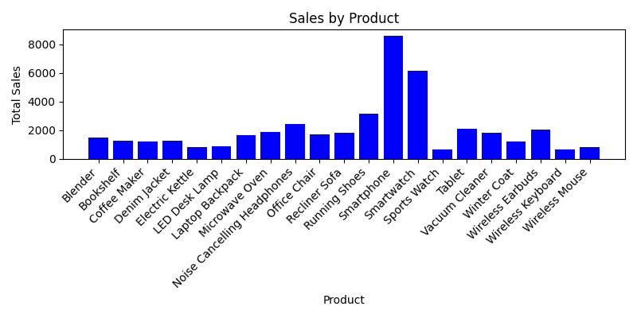
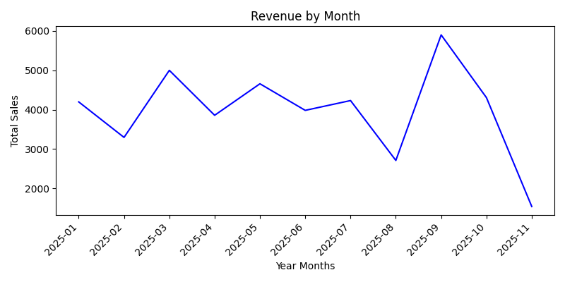

# 📊 Sales Analysis App

A simple **Tkinter-based desktop app** that generates a full **Sales Report** from your data.  
It supports **CSV, Excel, and Parquet** files, cleans the data, calculates summaries, builds pivot tables, generates charts, and exports everything into an **Excel report with charts embedded**.

---

## 🚀 Features
- ✅ Load sales data from **CSV, Excel, or Parquet**
- ✅ Clean missing values & remove duplicates
- ✅ Generate:
  - **Product Summary**
  - **Category Summary**
  - **Top 5 Products**
  - **Top 5 Categories**
  - **Pivot Table by Category & Month**
  - **Grand Totals**
- ✅ Create & embed:
  - **Bar chart (Sales by Product)**
  - **Line chart (Revenue by Month)**
- ✅ Export to Excel (`*_report.xlsx`) with charts inside
- ✅ User-friendly **Tkinter GUI**:
  - Welcome page
  - File chooser
  - Success popup when done

---

## 🖼️ Screenshots

### Welcome Page  


### Success Message  


### Example Chart (Bar)  


### Example Chart (Line)  


---

## 📂 Project Structure
```
sales_analysis_app/
│── main.py                # Tkinter app
│── requirements.txt       # Required dependencies
│── README.md              # Documentation
│── sales.csv              # Example input file
│── sales_report.xlsx      # Example generated report
│── sales_chart1.png       # Example bar chart
│── sales_chart2.png       # Example line chart
└── screenshots/           # (Add your GUI screenshots here)
```

---

## ⚙️ Installation

1. Clone the repository:
   ```bash
   git clone https://github.com/your-username/sales_analysis_app.git
   cd sales_analysis_app
   ```

2. Install dependencies:
   ```bash
   pip install -r requirements.txt
   ```

---

## ▶️ Usage

Run the app:
```bash
python main.py
```

1. Choose your sales file (`CSV`, `Excel`, or `Parquet`).  
2. Wait while the app processes data.  
3. A popup will confirm success and show the location of your generated report.  

The output includes:
- `*_report.xlsx` (Excel file with sheets + charts)  
- `*_chart1.png` and `*_chart2.png`  

---

## 📦 Dependencies
- pandas  
- matplotlib  
- openpyxl  
- tkinter (built-in with Python)

---

## 📝 Notes
- Your input file must contain at least:
  - `Date`
  - `Product`
  - `Category`
  - `Total Sales`
- Dates are automatically parsed into **Year-Month** format.

---

## 📌 Example
Input:  
`sales.csv` → raw sales records  

Output:  
`sales_report.xlsx` → Excel file with:
- Raw data  
- Product summary  
- Category summary  
- Top products & categories  
- Pivot table  
- Embedded charts  

---

## 📷 To Do
- [ ] Add more advanced visualizations  
- [ ] Support PDF report export  
- [ ] Add filter by region/customer  

---
